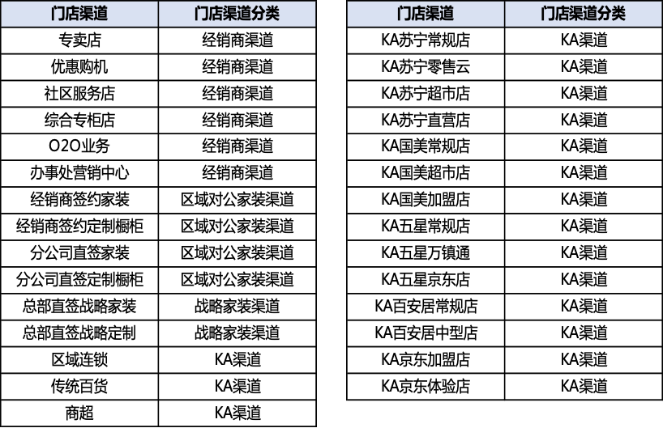

# 1. 订单渠道分类

​	根据DRP“门店渠道”字段为主，“家装渠道分类”字段为辅，将订单分为KA、经销商、区域对公家装、战略家装

| 门店渠道分类 | 门店渠道                           | 家装渠道分类 | 订单渠道分类 |
| ------------ | ---------------------------------- | ------------ | ------------ |
| KA           | 国美、苏宁、五星、百安居、传统百货 |              | kA           |
| 经销商       | 专卖店、网点、社区服务店等         | 空/无        | 经销商       |
| 经销商       | 专卖店、网点、社区服务店等         | 家装/定制    | 经销商       |
| 区域对公家装 | 家装、定制                         |              | 区域对公家装 |
| 战略家装     | 战略家装、战略定制                 |              | 战略家装     |

# 2. 门店渠道分类

“门店渠道分类”字段：根据DRP“门店渠道”匹配，将门店分为KA、经销商、区域对公家装、战略家装渠道

# 3. 家装渠道分类

“家装渠道分类”字段：根据DRP订单“家装渠道分类”识别，包括家装、定制、空、无（“空/无” 为非家装渠道订单）

# 4. 产品线分类

| 产品             | 产品线分类 | 台量系数 |
| ---------------- | ---------- | -------- |
| 大厨管家         | 其他       | 1        |
| 方太消毒柜       | 消毒柜     | 1        |
| 方太蒸烤微烹饪机 | 蒸烤微     | 3        |
| 方太洗碗机       | 洗碗机     | 1        |
| 方太蒸箱         | 蒸烤微     | 1        |
| 方太灶蒸烤烹饪机 | 灶集成     | 3        |
| 方太蒸锅         | 其他       | 1        |
| 米博料理机       | 其他       | 1        |
| 方太吸油烟机     | 油烟机     | 1        |
| 方太蒸烤烹饪机   | 蒸烤微     | 2        |
| 方太微波炉       | 蒸烤微     | 1        |
| 方太热水器       | 热水器     | 1        |
| 方太新风空净     | 其他       | 1        |
| 方太灶具         | 灶具       | 1        |
| 方太蒸微         | 蒸烤微     | 2        |
| 方太烤箱         | 蒸烤微     | 1        |
| 方太净水器       | 净水机     | 1        |
| 方太灶蒸烹饪机   | 灶集成     | 2        |
| 方太灶消烹饪机   | 灶集成     | 2        |
| 方太保温箱       | 其他       | 1        |

 

# 5. 重点产品线

集成烹饪中心、洗碗机、热水器、净水机

# 6. 集成灶重点区域

“集成灶重点区域”字段：基于公司第一战役山头区域（集成灶重点区域）划分标准，根据DRP门店省市区匹配，“是”为重点区域

# 7. 其他字段

1）“区市”、“区县”字段：根据DRP门店的省、市、区字段 

2）“城市分级”字段：基于2020年发布的第一财经城市分级，未分类的省直辖区县统一归为五线城市

 