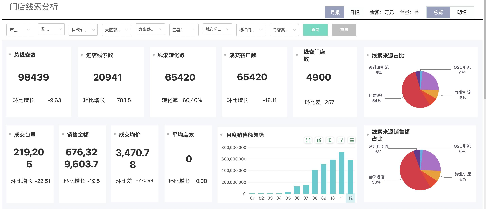
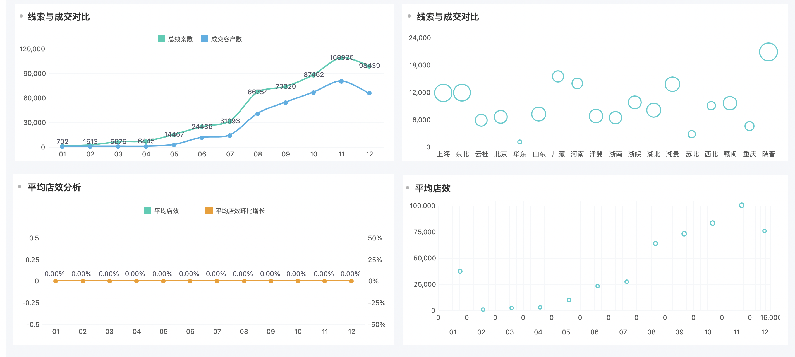
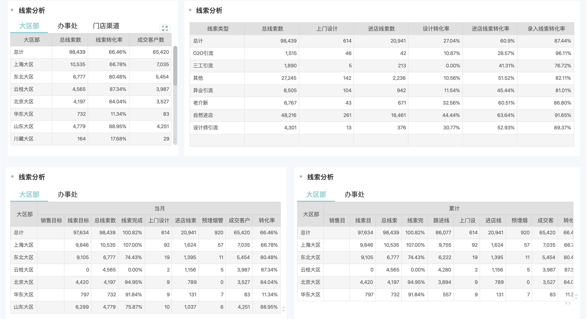
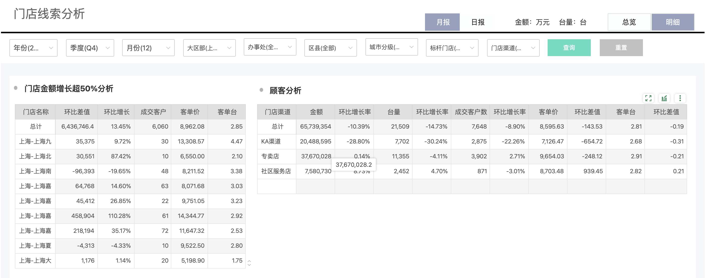
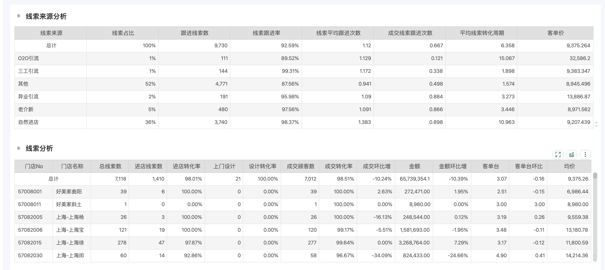

# 门店线索分析

# 1. UI图

## 1.1 总览








## 1.2 明细



# 

# 2.数据源

## 2.1.    db_ods_market.user_clues

所有的线索（审核，不审核，线索的总数从这里来）

·    主键id

·    follow_date 跟进时间, 计算 线索平均跟进时间

·    follow_up_status 跟进状态

·    audit_status   所有的数据取审核通过的线索

## 2.2.  db_ods_market.clues_follow_up线索更近表  

与user_clues表关联根据source_id

## 2.3.  db_ods_market.declaration_info 报单表   

线索成交之后的订单（头）

## 2.4. db_ods_market.goods_declaration 明细表（线索成交后的）

## 2.5. db_ods_market.channel_category 

FULL_PATH_NAME字段，分隔符是"-",取第二个字段，直接排除 ( '战略家装渠道', '办事处营销中心' )。

```sql
WHEN ( SPLIT_PART( CHANNEL_CATEGORY.FULL_PATH_NAME, '-', 2 ) LIKE'%KA%' OR SPLIT_PART( CHANNEL_CATEGORY.FULL_PATH_NAME, '-', 2 ) = '传统百货' ) THEN
   'KA渠道' 
WHEN SPLIT_PART( CHANNEL_CATEGORY.FULL_PATH_NAME, '-', 2 ) = '分公司直签家装定制' THEN
   '区域对公家装渠道' ELSE SPLIT_PART( CHANNEL_CATEGORY.FULL_PATH_NAME, '-', 2 )
```

**那涉及门店数的指标，只有专卖店和社区服务器有数**


# 3.取数关键字段逻辑

## 3.1.    总线索数

db_ods_market.user_clues表audit_status=2审核状态为审核通过的

## 3.2.    跟进线索数

除了follow_up_state=0 的线索，其他状态都取数

## 3.3.    进店线索数

db_ods_market.user_clues表is_into_stores=1

## 3.4.    线索转化数

db_ods_market.user_clues表follow_up_status=4

## 3.5    上门设计数

·    service_action字段包含2的线索数量

## 3.6.    销售金额

db_ods_market.declaration_info表SUM(goods_amount)

## 3.7.    成交台量

db_ods_market.declaration_info表SUM(goods_num)


# 4. 重点计算指标

## 4.1 上门设计转化率

已上门设计且已成交线索数/上门设计线索数*100%

## 4.2 进店线索转化率

线索转化数/进店线索数*100%

## 4.3 录入线索转化率

线索转化数/总线索数*100%

## 4.4 客单价

销售金额/成交客户数

## 4.5 成交均价

成交金额/订单数

环比差值=当期-上期

## 4.6 平均店效

销售金额/门店数

## 4.7 线索平均转化周期

（线索开始时间-线索成交时间）/成交线索数量

## 4.8 线索平均跟进次数

线索的跟进次数/总线索数

## 4.9 成交线索平均跟进次数

成交线索的跟进次数/成交线索数

## 4.10 成交客户数

=线索转化数

## 4.11 门店数

有线索的门店数（去重）

环比差值=当期-上期


